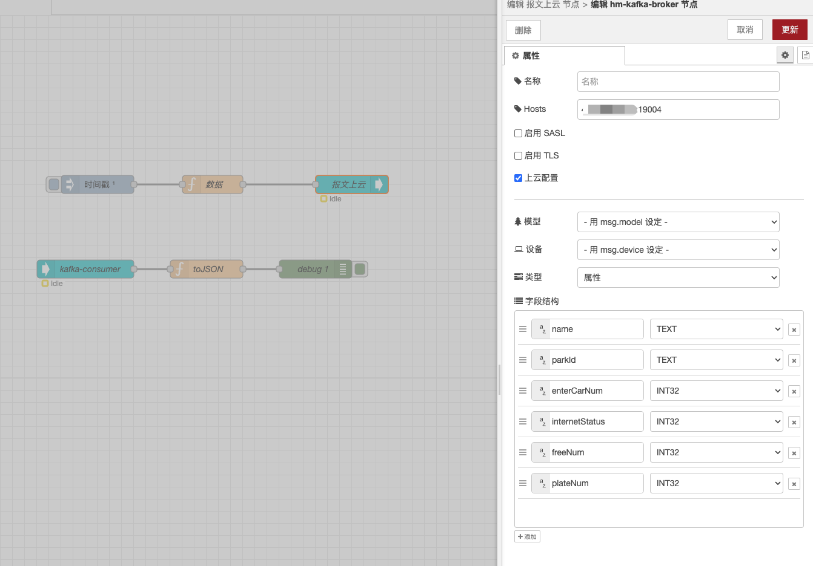

# @edgeflow/kafka-client

[](https://www.npmjs.com/package/@edgeflow/kafka-client)

EdgeFlow Kafka Consumer and Producer

This node can be used in order to produce and consume messages to Kafka. It is highly depends on 'kafka-node' library. Consists three nodes.

- hm-kafka-broker
- hm-kafka-producer
- hm-karka-consumer

Note: This library add sasl/plain supports base on kafka-client project. Now supports SCRAM-SHA-256 and SCRAM-SHA-512 authentication mechanisms.

## Input Parameters
### kafka-broker
#### Name (Optional)
Name wanted to be shown in Node
#### Hosts
Host names comma delimited (Multiple host is provided)
#### Use TLS
Check if tls security is required for Kafka Cluster
#### CA Certs (Optional)
CA Root certificate path defined in Kafka Cluster
#### Client Cert (Optional)
Client cert path created by openssl derived from Private Key (pem)
#### Private Key (Optional)
Private Key path created by openssl (pem)
#### Passphare (Optional)
Passphrase of created private Key
#### Self Sign
Check if want to be allowed untrusted certificates

#### Use SASL
Check if SASL security is required for Kafka Cluster
#### SASL Mechanism
Select the SASL authentication mechanism: PLAIN, SCRAM-SHA-256, or SCRAM-SHA-512
#### SASL Username (Optional)
SASL Username
#### SASL Password (Optional)
SASL Password

### kafka-producer
#### Name (Optional)
Name wanted to be shown in NodeRename your node
#### Broker
Broker which is wanted to be connect
#### Topic
Topic name of selected broker which is wanted to be consume
#### Require Ack
Default value is 1. 0 can be past if Acknowledge is not required.
#### Ack Timeout
Timeout of acknowledge response.
#### Attiributes
Can be selected if compression is important

### kafka-consumer
#### Name (Optional)
Name wanted to be shown in NodeRename your node
#### Broker
Broker which is wanted to be connect
#### Topic
Topic name of selected broker which is wanted to be consume
#### From Offset
'latest', 'none' or 'earliest' options can be selected
#### Out of Range Offset
'latest', 'none' or 'earliest' options can be selected

## Installation
```
npm install @edgeflow/kafka-client
```

## Usage
1. Example JSON here
```JSON
{"topic":"TOPIC_NAME","value":"DENEME","offset":16638,"partition":0,"highWaterOffset":16639,"key":null,"timestamp":"2020-08-19T08:58:27.866Z"}
```
## Screenshots





## IoT Parameter Description

Source format

```json
{
    "enterCarNum": 105,
    "internetStatus": 1,
    "dataTime": 1706438947487,
    "name": "G-end pre-release parking lot",
    "freeNum": 4997,
    "plateNum": 5102,
    "parkId": "20201130105422734010026003601298"
}

```

broker enables IoT cloud configuration and automatically formats it as:

```json
{
  "mc": "121212",
  "dc": "343434",
  "type": "props",
  "nameTypes": [
    "name:TEXT",
    "parkId:TEXT",
    "enterCarNum:INT32",
    "internetStatus:INT32",
    "freeNum:INT32",
    "plateNum:INT32"
  ],
  "ts": [1706442643979],
  "values": [
    ["G-end pre-release parking lot", "20201130105422734010026003601298", 105, 1, 4997, 5102]
  ]
}

```

flows code

```json
[
    {
        "id": "38455e3c08fa62ab",
        "type": "tab",
        "label": "Flow 1",
        "disabled": false,
        "info": "",
        "env": []
    },
    {
        "id": "b8e47102069aaad9",
        "type": "inject",
        "z": "38455e3c08fa62ab",
        "name": "",
        "props": [
            {
                "p": "payload"
            },
            {
                "p": "topic",
                "vt": "str"
            }
        ],
        "repeat": "",
        "crontab": "",
        "once": true,
        "onceDelay": 0.1,
        "topic": "",
        "payload": "",
        "payloadType": "date",
        "x": 300,
        "y": 280,
        "wires": [
            [
                "e5701b52b51b6c72"
            ]
        ]
    },
    {
        "id": "e5701b52b51b6c72",
        "type": "function",
        "z": "38455e3c08fa62ab",
        "name": "Data",
        "func": "msg.broker = {};\nmsg.broker.model = '121212'\nmsg.broker.device = '343434'\n\nmsg.payload = {\n    \"enterCarNum\": 105,\n    \"internetStatus\": 1,\n    \"dataTime\": 1706438947487,\n    \"name\": \"G-end pre-release parking lot\",\n    \"freeNum\": 4997,\n    \"plateNum\": 5102,\n    \"parkId\": \"20201130105422734010026003601298\"\n}\n\nreturn msg;",
        "outputs": 1,
        "timeout": 0,
        "noerr": 0,
        "initialize": "",
        "finalize": "",
        "libs": [],
        "x": 490,
        "y": 280,
        "wires": [
            [
                "ce8b5c02b1f4c17c"
            ]
        ]
    },
    {
        "id": "ce8b5c02b1f4c17c",
        "type": "hm-kafka-producer",
        "z": "38455e3c08fa62ab",
        "name": "",
        "broker": "f7b89f9454780a93",
        "topic": "iot-tablet-props-test",
        "requireAcks": 1,
        "ackTimeoutMs": 100,
        "attributes": 0,
        "x": 720,
        "y": 280,
        "wires": []
    },
    {
        "id": "4b2b5ddfd4f03b36",
        "type": "hm-kafka-consumer",
        "z": "38455e3c08fa62ab",
        "name": "",
        "broker": "f7b89f9454780a93",
        "outOfRangeOffset": "earliest",
        "fromOffset": "latest",
        "topic": "iot-tablet-props-test",
        "groupid": "",
        "encoding": "utf8",
        "x": 280,
        "y": 420,
        "wires": [
            [
                "dc995c6be8028295"
            ]
        ]
    },
    {
        "id": "04ad34e8b6dd113d",
        "type": "debug",
        "z": "38455e3c08fa62ab",
        "name": "debug 1",
        "active": true,
        "tosidebar": true,
        "console": false,
        "tostatus": false,
        "complete": "false",
        "statusVal": "",
        "statusType": "auto",
        "x": 660,
        "y": 420,
        "wires": []
    },
    {
        "id": "dc995c6be8028295",
        "type": "function",
        "z": "38455e3c08fa62ab",
        "name": "toJSON",
        "func": "const value = JSON.parse(msg.payload.value)\nmsg.payload = value\nreturn msg;",
        "outputs": 1,
        "timeout": 0,
        "noerr": 0,
        "initialize": "",
        "finalize": "",
        "libs": [],
        "x": 480,
        "y": 420,
        "wires": [
            [
                "04ad34e8b6dd113d"
            ]
        ]
    },
    {
        "id": "f7b89f9454780a93",
        "type": "hm-kafka-broker",
        "name": "",
        "hosts": "147.13.93.122:19004",
        "usesasl": false,
        "username": "",
        "password": "",
        "usetls": false,
        "cacert": "",
        "clientcert": "",
        "privatekey": "",
        "passphrase": "",
        "selfsign": false,
        "useiot": true,
        "model": "use",
        "device": "use",
        "iotType": "props",
        "fields": [
            {
                "fieldName": "name",
                "dataType": "TEXT"
            },
            {
                "fieldName": "parkId",
                "dataType": "TEXT"
            },
            {
                "fieldName": "enterCarNum",
                "dataType": "INT32"
            },
            {
                "fieldName": "internetStatus",
                "dataType": "INT32"
            },
            {
                "fieldName": "freeNum",
                "dataType": "INT32"
            },
            {
                "fieldName": "plateNum",
                "dataType": "INT32"
            }
        ]
    }
]
```